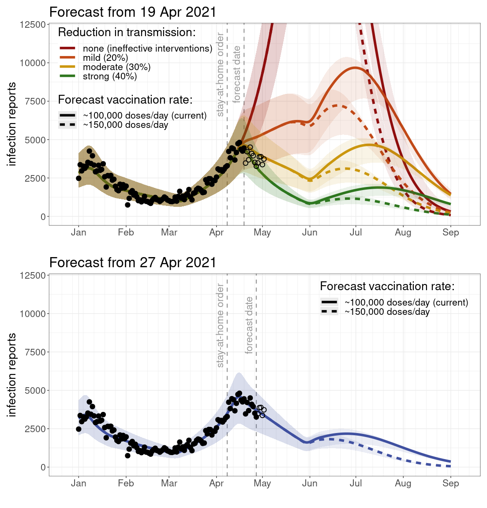

<!-- set up custom css classes for the different scenarios to make marking up the text less cumbersome... sc1 = scenario 1 -->

_Post last updated: 02 May 2021_

# Context

Every two weeks, [our group](https://mac-theobio.github.io/covid-19/) provides COVID-19 infection report forecasts for the province of Ontario to the [Ontario Modelling Consensus Table](https://covid19-sciencetable.ca/our-partners/) (MCT), a partner of the [Ontario Science Advisory Table](https://covid19-sciencetable.ca) (SAT), which presents this information to the Health Coordination Table of the Ontario Ministry of Health.^[This report has been written independently of the Ontario Modelling Consensus Table, the Ontario Science Advisory Table, and the Health Coordination Table. The views expressed in this report are solely the authors’.] Other modelling groups also provide forecasts to the MCT.  After reviewing all forecasts provided, the MCT provides consensus projections to the SAT.

Our forecasts are based on a [compartmental epidemic model](https://en.wikipedia.org/wiki/Compartmental_models_in_epidemiology) implemented in our publicly available [`McMasterPandemic`](https://github.com/bbolker/McMasterPandemic) R package, and involve statistical fits to [Ontario's latest infection report data](https://covid-19.ontario.ca/data).

# Forecast overview

The forecasts presented here were made on **19 April 2021** and **27 April 2021**.

The 19 April forecasts were submitted to the MCT for inclusion in the [public briefing by the SAT on 29 April 2021](https://www.youtube.com/watch?v=nIZkgeOOo5I).

Because of the delay between the moment of infection and when a case is reported, we cannot directly estimate the effects of changes that occur two weeks or less before the date of our forecasts. As a result, we were not able to fit the effects of the 8 April stay-at-home order in the 19 April forecasts. The best we can do in this case is consider scenarios for the effectiveness of changes (for example, interventions like stay-at-home orders). The scenarios considered for the 19 April forecasts are outlined [below](#measures_scenarios).

On 27 April, enough data had accumulated since the 8 April stay-at-home order for us to estimate its effect on transmission, and this estimate is included in that forecast.

We have updated, and will continue to update, this post in order to show the [latest infection reports](https://covid-19.ontario.ca/data), but the forecasts themselves have not, and will not, be modified after the forecast date.

The most recent infection reports indicate which of the 19 April scenarios turned out to be closest to reality (and therefore suggest the degree to which public health measures, changes in behaviour, or vaccine uptake, have been effective).  When multiple changes have occurred simultaneously (for example, closing schools and restricting travel), it is very difficult, if not impossible, to determine which changes had the greatest impact on disease transmission.

# Forecast results

The following figures gives the infection report forecasts (curves), with 95% confidence intervals as bands around each forecast curve. Observed infection reports to which the model was fit are plotted with **solid points**, while observations after the fact are included as **hollow points**.

<!-- -->

The transmission reduction fit to data in the 27 April forecast is about 30%, so the epidemic trajectory that we predict going forward is very similar to the "moderate" scenario considered on 19 April.

# Forecast details 

## 19 April 2021 intervention effect scenarios

In the 19 April forecasts, we considered four scenarios for the combined effects of the 30 March "emergency brake" and the 8 April provincial stay-at-home order on the overall reduction in disease transmission. The scenarios we explore are that these interventions:

1. are ineffective and do not reduce transmission from pre-stay-at-home levels (the latest level of activity detectable in the infection report data due to the 1-2 week reporting delay for infections);

2. result in a mild reduction in transmission (20%);

3. result in a moderate reduction in transmission (30%);

4. result in a strong reduction in transmission (40%).

After the six-week stay-at-home order ends (on 23 May), we assume that transmission returns to the levels observed right before the order came into effect (but this change doesn't become apparent in the forecasts for approximately two weeks, due to the delay between infections and infection reports).

## 27 April 2021 intervention effect estimate

Since more than two weeks had elapsed since the 30 March emergency break and 8 April stay-at-home order when this forecast was made, we were able to estimate the early reduction in transmission that resulted from these interventions. As a result, this set of forecasts use the approximately 30% reduction in transmission estimated from infection report data, as opposed to any hypothetical intervention effect scenarios.

## Vaccination

### Assumptions

In all of the forecasts presented here, the vaccination assumptions are that:

* doses are administered at the [reported dose administration rate](https://covid19tracker.ca/vaccinationtracker.html) up to the forecast date;
* all vaccines administered are 60% effective at preventing infection;
* if the vaccine confers immunity in an individual, immunity immediately takes effect 14 days after a first dose and does not wane;
* vaccines are administered at random in the population.

### Scenarios

In the forecast period, the vaccination scenarios we explore are that:

1. vaccination continues at the current seven-day average rate of **~100,000 first doses/day** (*solid lines*);

2. the current average rate is increased by 50% to **~150,000 first doses/day** (*dashed lines*).

---

Related post: [Early prediction of Ontario’s third COVID-19 wave](https://mac-theobio.github.io/forecasts/outputs/ON_accuracy.html)

[Back to the MacTheobio COVID Modelling Group page](https://mac-theobio.github.io/covid-19/)

<!-- EXPORT CSV -->

